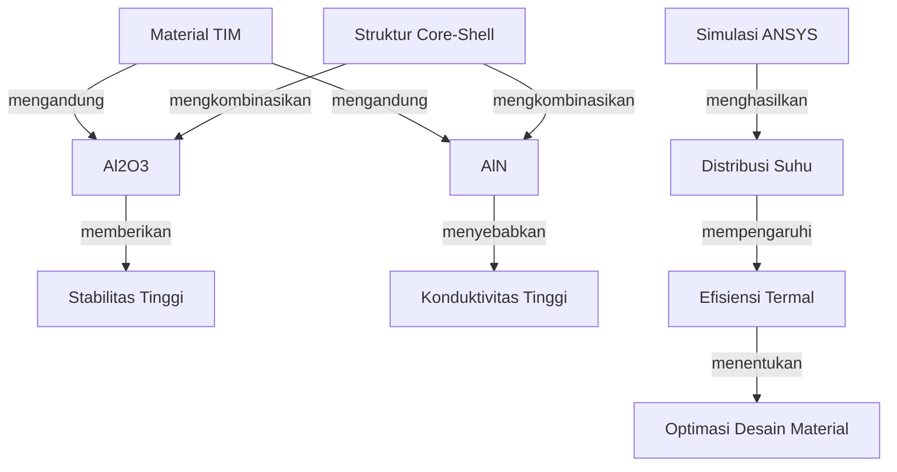

```mermaid
graph TD
  A[Material TIM] -->|mengandung| B[Al2O3]
  A -->|mengandung| C[AlN]
  B -->|memberikan| D[Stabilitas Tinggi]
  C -->|menyebabkan| E[Konduktivitas Tinggi]
  F[Struktur Core-Shell] -->|mengkombinasikan| B
  F -->|mengkombinasikan| C
  G[Simulasi ANSYS] -->|menghasilkan| H[Distribusi Suhu]
  H -->|mempengaruhi| I[Efisiensi Termal]
  I -->|menentukan| J[Optimasi Desain Material]


```
