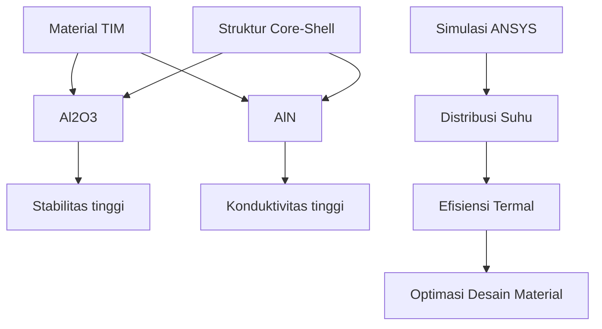

```mermaid
graph TD
  A[Material TIM] --> B[Al2O3]
  A --> C[AlN]
  B --> D[Stabilitas tinggi]
  C --> E[Konduktivitas tinggi]
  F[Struktur Core-Shell] --> B
  F --> C
  G[Simulasi ANSYS] --> H[Distribusi Suhu]
  H --> I[Efisiensi Termal]
  I --> J[Optimasi Desain Material]

```
