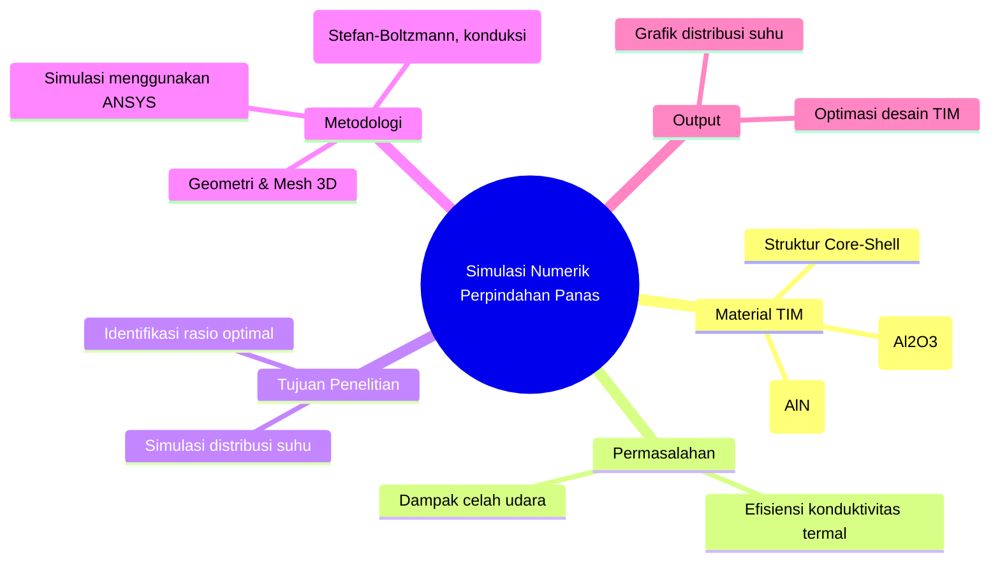

```mermaid
mindmap
  root((Simulasi Numerik Perpindahan Panas))
    Material TIM
      Alumina (Al2O3)
      Aluminium Nitride (AlN)
      Struktur Core-Shell
    Permasalahan
      Efisiensi konduktivitas termal
      Dampak celah udara
    Tujuan Penelitian
      Identifikasi rasio optimal
      Simulasi distribusi suhu
    Metodologi
      Geometri & Mesh 3D
      Parameter termal (Stefan-Boltzmann, konduksi)
      Simulasi menggunakan ANSYS
    Output
      Grafik distribusi suhu
      Optimasi desain TIM
```

